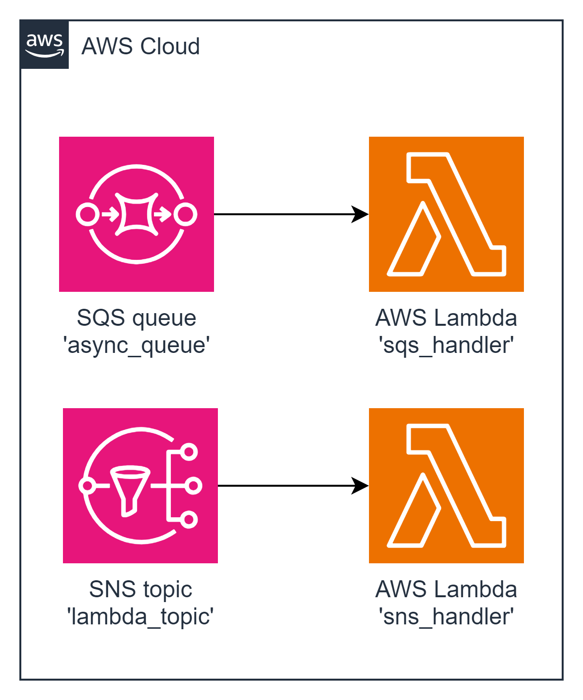

# task04 New Tools: Amazon Simple Queue Service (SQS) and Simple Notification Service (SNS)

This task involves creating two Lambda integrations: one with an SQS queue and another with an SNS topic. The 'SQS Handler' Lambda should be triggered by an SQS queue and log the message content to CloudWatch Logs. Similarly, the 'SNS Handler' Lambda should be triggered by an SNS topic and log the message content to CloudWatch Logs.

+ Create an 'SQS Handler' Lambda that logs messages from an SQS queue.
+ Create an 'SNS Handler' Lambda that logs messages from an SNS topic.

##Resources Names

+ Lambda Function 1: `sqs_handler`
+ SQS Queue: `async_queue`
+ Lambda Function 2: `sns_handler`
+ SNS Topic: `lambda_topic`


## task04 diagram



---

## Deployment from scratch
1. Generate Project:

Use aws-syndicate to [generate a new project](https://github.com/epam/aws-syndicate/wiki/2.-Quick-start#221-creating-project-files). This will set up the basic structure needed for your Lambda deployment.
```powershell
syndicate generate project --name task04
```
2. Generate Config:

+ Navigate to task03 folder
```powershell
cd .\task04\
```
* Use aws-syndicate to generate a [config for your project](https://github.com/epam/aws-syndicate/wiki/2.-Quick-start#222-creating-configuration-files-for-environment3. ).
  This will set up configuration files syndicate.yml and syndicate_aliases.yml that may be edited later.
```powershell
syndicate generate config --name "dev" `
    --region "eu-central-1" `
    --bundle_bucket_name "syndicate-education-platform-custom-sandbox-artifacts-sbox02/2fa561ce/task04" `
    --prefix "cmtr-2fa561ce-" `
    --extended_prefix "true" `
    --tags "course_id:SEP_GL_7,course_type:stm,student_id:2fa561ce,type:student" `
    --iam_permissions_boundary "arn:aws:iam::905418349556:policy/eo_role_boundary" `
    --access_key "ACCESS_KEY" `
    --secret_key "SECRET_KEY" `
    --session_token "SESSION_TOKEN"
```

* Set up the SDCT_CONF environment variable pointing to the folder with syndicate.yml file.
```powershell
  $env:SDCT_CONF = "C:\projects\aws_deep_dive\AWS-Syndicate\task04\.syndicate-config-dev"
  echo $env:SDCT_CONF
```
3. Generate 'SQS Handler' Lambda Function:

Inside your project, use aws-syndicate to [generate a Lambda function](https://github.com/epam/aws-syndicate/wiki/2.-Quick-start#224-creating-lambda-files). This step will create the necessary files and configurations
```powershell
syndicate generate lambda --name sqs_handler  --runtime java
```

4. Generate SQS Queue Resource in Meta:

Use aws-syndicate to [generate metadata for an SQS queue resource](https://github.com/epam/aws-syndicate/wiki/4.-Resources-Meta-Descriptions#412-sqs-queue).
```powershell
syndicate generate meta sqs_queue --resource_name async_queue --region eu-central-1
```

```powershell
syndicate generate meta api_gateway_resource --api_name task3_api --path hello
```

```powershell
syndicate generate meta api_gateway_resource_method --api_name task3_api --path hello --method GET --integration_type lambda --lambda_name hello_world --lambda_region eu-central-1
```

5. Build and Deploy Project with the Syndicate Tool:

Use the aws-syndicate tool to [build and deploy your project](https://github.com/epam/aws-syndicate/wiki/2.-Quick-start#231-create-an-s3-bucket-for-aws-syndicate-artifacts). This step packages and deploys your Lambda function along with the configured API Gateway.
```powershell
syndicate create_deploy_target_bucket
```

+ [Build](https://videoportal.epam.com/video/qYLn4xd7) the artifacts of the application and create a bundle:
```powershell
syndicate build -F -b task03_250208.225707
```
+ [Deploy](https://videoportal.epam.com/video/AaZWOPjY) the bundle:
```powershell
syndicate deploy --replace_output -b task03_250208.225707
```