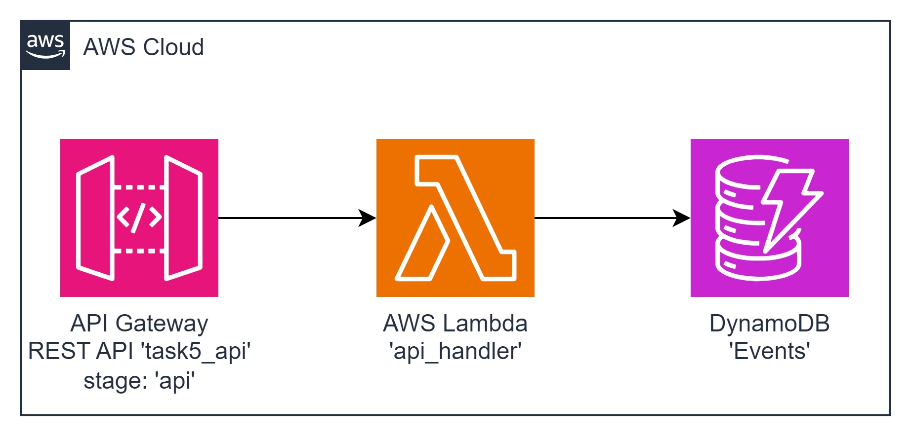

# task05 AWS Lambda + DynamoDB Integration

This task involves deploying a Lambda function, an API Gateway, and a DynamoDB table named 'Events'. The goal is to create an API endpoint that saves incoming events to the 'Events' table in DynamoDB. The API must expose a `/events` POST resource.

To deploy a Lambda function that, when triggered by the API Gateway, saves incoming events to the DynamoDB 'Events' table and returns the created event as a response.

### Resources Names
+ Lambda Function: api_handler; lambdas_alias_name: learn
+ API Gateway: API Name: task5_api; Stage Name: api; Resource: POST /events
+ DynamoDB Table: Events; alias target_table: Events


### Request:
```json
{
    "principalId": int         // id pf the principal
    "content": {any Map<String, String>} 
}
```
### Response:
```json
{
    "statusCode": 201,
    "event":         // created event json
}
```
### 'Event' data model:

```json
{
    "id":         //uuidv4 hash key
    "principalId":     //int
    "createdAt":     //date time in ISO 8601 formatted string, example: 2024-01-01T00:00:00.000Z|2024-01-01T00:00:00.000000
    "body": { /** 'content' value */ }
}
```

##  diagram



---

## Deployment from scratch
1. Generate Project:

Use aws-syndicate to [generate a new project](https://github.com/epam/aws-syndicate/wiki/2.-Quick-start#221-creating-project-files). This will set up the basic structure needed for your Lambda deployment.
```powershell
syndicate generate project --name task05
```
2. Generate Config:

+ Navigate to task05 folder
```powershell
cd .\task05\
```
* Use aws-syndicate to generate a [config for your project](https://github.com/epam/aws-syndicate/wiki/2.-Quick-start#222-creating-configuration-files-for-environment3. ).
  This will set up configuration files syndicate.yml and syndicate_aliases.yml that may be edited later.
```powershell
syndicate generate config --name "dev" `
    --region "eu-central-1" `
    --bundle_bucket_name "syndicate-education-platform-custom-sandbox-artifacts-sbox02/2fa561ce/task05" `
    --prefix "cmtr-2fa561ce-" `
    --extended_prefix "true" `
    --tags "course_id:SEP_GL_7,course_type:stm,student_id:2fa561ce,type:student" `
    --iam_permissions_boundary "arn:aws:iam::905418349556:policy/eo_role_boundary" `
    --access_key "ACCESS_KEY" `
    --secret_key "SECRET_KEY" `
    --session_token "SESSION_TOKEN"
```

* Set up the SDCT_CONF environment variable pointing to the folder with syndicate.yml file.
```powershell
  $env:SDCT_CONF = "C:\projects\aws_deep_dive\AWS-Syndicate\task05\.syndicate-config-dev"
  echo $env:SDCT_CONF
```
3. Generate 'api_handler' Lambda Function:

Inside your project, use aws-syndicate to [generate a Lambda function](https://github.com/epam/aws-syndicate/wiki/2.-Quick-start#224-creating-lambda-files). This step will create the necessary files and configurations
```powershell
syndicate generate lambda --name api_handler  --runtime java
```

4. Generate API Gateway Metadata:

Use aws-syndicate to [generate API Gateway metadata](https://github.com/epam/aws-syndicate/wiki/4.-Resources-Meta-Descriptions#45-api-gateway) that includes the required API resources:

```powershell
syndicate generate meta api_gateway --resource_name task5_api --deploy_stage api
```

```powershell
syndicate generate meta api_gateway_resource --api_name task5_api --path events --enable_cors
```

```powershell
syndicate generate meta api_gateway_resource_method --api_name task5_api --path events --method POST --integration_type lambda --lambda_name api_handler --lambda_region eu-central-1
```

5. Generate DynamoDB Table Metadata:

Use aws-syndicate to [generate metadata for a DynamoDB](https://github.com/epam/aws-syndicate/wiki/4.-Resources-Meta-Descriptions#421-dynamo-db-table) table named 'Events'.
```powershell
syndicate generate meta dynamodb --resource_name Events --hash_key_name id --hash_key_type S
```

---

### Build and Deploy Project with the Syndicate Tool:

Use the aws-syndicate tool to [build and deploy your project](https://github.com/epam/aws-syndicate/wiki/2.-Quick-start#231-create-an-s3-bucket-for-aws-syndicate-artifacts). This step packages and deploys your Lambda function along with the configured API Gateway.
```powershell
syndicate create_deploy_target_bucket
```

+ [Build](https://videoportal.epam.com/video/qYLn4xd7) the artifacts of the application and create a bundle:
```powershell
syndicate build -F -b task05_250209.191131
```
+ [Deploy](https://videoportal.epam.com/video/AaZWOPjY) the bundle:
```powershell
syndicate deploy --replace_output -b task05_250209.191131
```

---

### Verification
+ Use the AWS SQS Console or CLI to send a message to the configured SQS queue.
+ Check CloudWatch Logs to ensure that the 'SQS Handler' Lambda flushes the message content.
+ Use the AWS SNS Console or CLI to send a message to the configured SNS topic.
+ Check CloudWatch Logs to ensure that the 'SNS Handler' Lambda flushes the message content.

```
curl --location 'https://iy1e97ro6a.execute-api.eu-central-1.amazonaws.com/api/events' \
--header 'Content-Type: application/json' \
--data '{
    "principalId": 1,
    "content": {"name": "cmtr-2fa561ce", "surname": "Doe"} 
}'
```