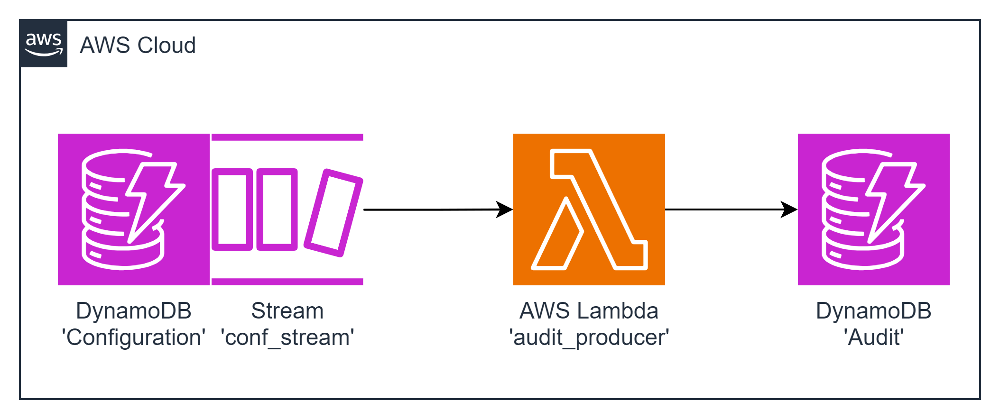

# task05 AWS Lambda + DynamoDB Stream Integration

This task involves deploying a Lambda function and two DynamoDB tables: 'Configuration' and 'Audit'. The goal is to track changes made to configuration items in the 'Configuration' table and store audit entries in the 'Audit' table.

To deploy a Lambda function triggered by a DynamoDB Stream on the 'Configuration' table. The Lambda function should track changes made to configuration items and store audit entries in the 'Audit' table.
### Resources Names
+ Lambda Function: `audit_producer` | lambdas_alias_name: learn
+ DynamoDB Table 1: `Configuration`
+ DynamoDB Table 2: `Audit`| target_table: Audit


### The 'Configuration' data is the following:
```json
{
  "key": "CACHE_TTL_SEC",
  "value": 3600
}
```
### After the configuration item is saved to the table the following audit item has been created in the 'Audit' table:
```json
{
  "id": // string, uuidv4
  "itemKey": "CACHE_TTL_SEC",
  "modificationTime": // string, ISO8601 formatted string, example: 2024-01-01T00:00:00.000Z|2024-01-01T00:00:00.000000
  "newValue": {
    "key": "CACHE_TTL_SEC",
    "value": 3600
  }
}
```

### After the configuration item is updated to the table the following audit item has been created in the 'Audit' table:
```json
{
  "id": // string, uuidv4
  "itemKey": "CACHE_TTL_SEC",
  "modificationTime": // string, ISO8601 formatted string, example: 2024-01-01T00:00:00.000Z|2024-01-01T00:00:00.000000
  "updatedAttribute": "value",
  "oldValue": 3600,
  "newValue": 1800
}
```
``

##  diagram



---

## Deployment from scratch
1. Generate Project:

Use aws-syndicate to [generate a new project](https://github.com/epam/aws-syndicate/wiki/2.-Quick-start#221-creating-project-files). This will set up the basic structure needed for your Lambda deployment.
```powershell
syndicate generate project --name task06
```
2. Generate Config:

+ Navigate to task05 folder
```powershell
cd .\task06\
```
* Use aws-syndicate to generate a [config for your project](https://github.com/epam/aws-syndicate/wiki/2.-Quick-start#222-creating-configuration-files-for-environment3. ).
  This will set up configuration files syndicate.yml and syndicate_aliases.yml that may be edited later.
```powershell
syndicate generate config --name "dev" `
    --region "eu-central-1" `
    --bundle_bucket_name "syndicate-education-platform-custom-sandbox-artifacts-sbox02/2fa561ce/task06" `
    --prefix "cmtr-2fa561ce-" `
    --extended_prefix "true" `
    --tags "course_id:SEP_GL_7,course_type:stm,student_id:2fa561ce,type:student" `
    --iam_permissions_boundary "arn:aws:iam::905418349556:policy/eo_role_boundary" `
    --access_key "ACCESS_KEY" `
    --secret_key "SECRET_KEY" `
    --session_token "SESSION_TOKEN"
```

* Set up the SDCT_CONF environment variable pointing to the folder with syndicate.yml file.
```powershell
  $env:SDCT_CONF = "C:\projects\aws_deep_dive\AWS-Syndicate\task06\.syndicate-config-dev"
  echo $env:SDCT_CONF
```
3. Generate 'audit_producer' Lambda Function:

Inside your project, use aws-syndicate to [generate a Lambda function](https://github.com/epam/aws-syndicate/wiki/2.-Quick-start#224-creating-lambda-files). This step will create the necessary files and configurations
```powershell
syndicate generate lambda --name audit_producer  --runtime java
```

4. Generate 'Configuration' Table Metadata:

Use aws-syndicate to [generate metadata for a DynamoDB](https://github.com/epam/aws-syndicate/wiki/4.-Resources-Meta-Descriptions#421-dynamo-db-table) table named 'Events'.
```powershell
syndicate generate meta dynamodb --resource_name Configuration --hash_key_name key --hash_key_type S
```
5. Configure DynamoDB Stream:

Configure the 'Configuration' table with a DynamoDB Stream that triggers the Lambda function on changes.

6. Generate 'Audit' Table Metadata:

Use aws-syndicate to [generate metadata for a DynamoDB](https://github.com/epam/aws-syndicate/wiki/4.-Resources-Meta-Descriptions#421-dynamo-db-table) table named 'Events'.
```powershell
syndicate generate meta dynamodb --resource_name Audit --hash_key_name id --hash_key_type S
```
7. Implement the Logic of the Function:

In the Lambda function code, implement the logic to handle DynamoDB Stream events, track changes made to configuration items, and store audit entries in the 'Audit' table.

---

### Build and Deploy Project with the Syndicate Tool:

Use the aws-syndicate tool to [build and deploy your project](https://github.com/epam/aws-syndicate/wiki/2.-Quick-start#231-create-an-s3-bucket-for-aws-syndicate-artifacts). This step packages and deploys your Lambda function along with the configured API Gateway.
```powershell
syndicate create_deploy_target_bucket
```

+ [Build](https://videoportal.epam.com/video/qYLn4xd7) the artifacts of the application and create a bundle:
```powershell
syndicate build -F -b task06_250210.135323
```
+ [Deploy](https://videoportal.epam.com/video/AaZWOPjY) the bundle:
```powershell
syndicate deploy --replace_output -b task06_250210.135323
```

---

### Verification
1.  Check AWS Lambda Console:

+ Confirm that the Lambda function is listed in the AWS Lambda Console.
+ Verify that there are no deployment errors.

2. Check DynamoDB Console:

+ Confirm that the 'Configuration' and 'Audit' tables are listed in the AWS DynamoDB Console.
+ Verify that the 'Configuration' table has a DynamoDB Stream configured.

3. Check CloudWatch Logs:

+ Check the CloudWatch Logs for the Lambda function to ensure there are no errors logged during the execution.
4. Test the Application:

+ Create a configuration item in the 'Configuration' table.
+ Verify that an audit entry is created in the 'Audit' table.
5. Update Configuration Item:

+ Update a configuration item in the 'Configuration' table.
+ Verify that a corresponding audit entry is created in the 'Audit' table with the correct content.

Completing these steps successfully indicates that you have created a Lambda function triggered by a DynamoDB Stream, tracking changes to configuration items and storing audit entries in the 'Audit' table. Well done on completing this advanced AWS Lambda integration task!
