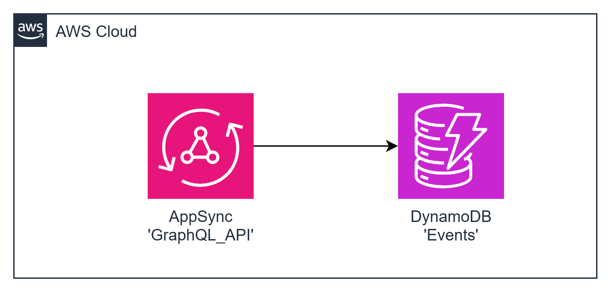

# task05 AWS AppSync + DynamoDB integration

This task involves deploying an AppSync API and a DynamoDB table named 'Events'.

## Main AppSync-related terminology
`Schema` is the foundation of a GraphQL API. It serves as the blueprint that defines the shape of your data. It's also a contract between your client and server that defines how your data will be retrieved and/or modified. [More details here](https://docs.aws.amazon.com/appsync/latest/devguide/schema-components.html)

`Type` defines the shape or behavior of your data. The fundamental building block of a GraphQL schema. [More details here](https://docs.aws.amazon.com/appsync/latest/devguide/graphql-types.html)

`Field` exists within the scope of a type and holds the value that's requested from the GraphQL service. [More details here](https://docs.aws.amazon.com/appsync/latest/devguide/graphql-fields.html)

`Data sources` are resources in your AWS account that GraphQL APIs can interact with. [More details here](https://docs.aws.amazon.com/appsync/latest/devguide/attaching-a-data-source.html)

`Resolver` is a unit of code that handles how that field's data will be resolved when a request is made to the service. [More details here](https://docs.aws.amazon.com/appsync/latest/devguide/resolver-components.html)

Project Example
To see a working example of an AppSync project implementation, please refer to the following link: [AppSync Project Example](https://github.com/epam/aws-syndicate/tree/master/examples/appsync/appsync-dynamodb).

To deploy an AppSync API that handles GraphQL requests saves incoming events to the DynamoDB 'Events' table, and allows getting event items by ID.

##  diagram



### Resources Names
+ AppSync API: GraphQL_API
+ DynamoDB Table: Events


### Event creation: Query:
```json
mutation createEvent($userId: Int!, $payLoad: AWSJSON!) {
  createEvent(userId: $userId, payLoad: $payLoad) {
    id
    createdAt
  }
}
```
###  Event creation: Query variables:
```json
{
  "userId":  //int
  "payLoad": "{\"meta\": {\"key1\": //int, \"key2\": //string}}"
}
```

###  Event creation: Response:
```json
{
  "data": {
    "createEvent": {
      "id":  //uuidv4
      "createdAt": //date time in ISO 8601 formatted string YYYY-MM-DDThh:mm:ss.sssZ
    }
  }
}
```

###  Event creation: 'Event' data model::
```json
{
  "id": //uuidv4 hash key
  "userId": //int
  "createdAt": //date time in ISO 8601 formatted string YYYY-MM-DDThh:mm:ss.sssZ
  "payLoad": {
  "meta": {
    "key1": //int
    "key2": //string
  }
}
}
```

###  Getting an event: Query:
```json
query getEvent($id: ID!) { getEvent(id: $id) {
id
userId
createdAt
payLoad {
meta {
key1
key2
}
}
}
}
```

###  Getting an event: Query variables:
```json
{
  "id": //uuidv4
}
```

###  Getting an event: Response:
```json
{
  "data": {
    "getEvent": {
      "id": //uuidv4,
      "userId": //int,
      "createdAt": //date time in ISO 8601 formatted string YYYY-MM-DDThh:mm:ss.sssZ,
      "payLoad": {
  "meta": {
    "key1": //int,
    "key2": //string
  }
}
}
}
}
```
---

## Authorization
Primary authorization mode must be configured as 'API_KEY'

## AppSync resolvers
The next resolvers are required for the task:
+ Mutation
- createEvent
+ Query
- getEvent

Both available runtime (JS and VTL) may be used to solve the task
``


---

## Deployment from scratch
1. Generate Project:

Use aws-syndicate to [generate a new project](https://github.com/epam/aws-syndicate/wiki/2.-Quick-start#221-creating-project-files). This will set up the basic structure needed for your Lambda deployment.
```powershell
syndicate generate project --name task07
```
2. Generate Config:

+ Navigate to task05 folder
```powershell
cd .\task07\
```
* Use aws-syndicate to generate a [config for your project](https://github.com/epam/aws-syndicate/wiki/2.-Quick-start#222-creating-configuration-files-for-environment3. ).
  This will set up configuration files syndicate.yml and syndicate_aliases.yml that may be edited later.
```powershell
syndicate generate config --name "dev" `
    --region "eu-central-1" `
    --bundle_bucket_name "syndicate-education-platform-custom-sandbox-artifacts-sbox02/2fa561ce/task07" `
    --prefix "cmtr-2fa561ce-" `
    --extended_prefix "true" `
    --tags "course_id:SEP_GL_7,course_type:stm,student_id:2fa561ce,type:student" `
    --iam_permissions_boundary "arn:aws:iam::905418349556:policy/eo_role_boundary" `
    --access_key "ACCESS_KEY" `
    --secret_key "SECRET_KEY" `
    --session_token "SESSION_TOKEN"
```

* Set up the SDCT_CONF environment variable pointing to the folder with syndicate.yml file.
```powershell
  $env:SDCT_CONF = "C:\projects\aws_deep_dive\AWS-Syndicate\task07\.syndicate-config-dev"
  echo $env:SDCT_CONF
```

3. Generate 'Events' Table Metadata:

Use aws-syndicate to [generate metadata for a DynamoDB](https://github.com/epam/aws-syndicate/wiki/4.-Resources-Meta-Descriptions#421-dynamo-db-table) table named 'Events'.
```powershell
syndicate generate meta dynamodb --resource_name Events --hash_key_name id --hash_key_type S
```

4. Generate IAM role metadata to be used with the AppSync

Use aws-syndicate to [generate metadata for an IAM role](https://github.com/epam/aws-syndicate/wiki/4.-Resources-Meta-Descriptions#410-iam-role)
deployment_resources.json rename or duplicate  lambda-basic-execution to appsync_policy

```powershell
syndicate generate meta iam_role --resource_name iam_role --principal_service appsync --custom_policies appsync_policy --instance_profile false
```

5. Generate AppSync API + data source + resolvers (Mutation and Query)

Use aws-syndicate to [generate metadata for an AppSync API](https://github.com/epam/aws-syndicate/wiki/4.-Resources-Meta-Descriptions#4281-api)
```powershell
syndicate generate appsync api --name GraphQL_API
```

```powershell
syndicate generate appsync data_source --api_name GraphQL_API --name dynamoDB_EVENTS --type AMAZON_DYNAMODB --resource_name Events --service_role_name iam_role
```

```powershell
syndicate generate appsync resolver --api_name GraphQL_API --kind UNIT --type_name Mutation --field_name createEvent --data_source_name dynamoDB_EVENTS --runtime VTL
```

```powershell
syndicate generate appsync resolver --api_name GraphQL_API --kind UNIT --type_name Query --field_name getEvent --data_source_name dynamoDB_EVENTS --runtime JS
```

6. Define resolvers code/mapping templates


---

### Build and Deploy Project with the Syndicate Tool:

Use the aws-syndicate tool to [build and deploy your project](https://github.com/epam/aws-syndicate/wiki/2.-Quick-start#231-create-an-s3-bucket-for-aws-syndicate-artifacts). This step packages and deploys your Lambda function along with the configured API Gateway.
```powershell
syndicate create_deploy_target_bucket
```

+ [Build](https://videoportal.epam.com/video/qYLn4xd7) the artifacts of the application and create a bundle:
```powershell
syndicate build -F -b task07_250210.171007
```
+ [Deploy](https://videoportal.epam.com/video/AaZWOPjY) the bundle:
```powershell
syndicate deploy --replace_output -b task07_250210.171007
```
---
1Configure API Client:

+ Choose an API client that supports GraphQL queries such as Postman or Altair.
+ Set up a request to the AppSync API GraphQL endpoint.
+ Send a request with the required query.
+ Verify that the response matches the expected output, and check the DynamoDB table to ensure the event is stored.

---

### Verification
1.  Check AWS AppSync Console:

+ Confirm that the AppSync API is listed in the AWS AppSync Console.
2. Check DynamoDB Console:

+ Confirm that the 'Events' table is listed in the AWS DynamoDB Console.
+ Verify that events are being stored in the table.
3. API Client Request:

+ Use your chosen API client (Postman, Altair) to send a query with the required payload.
+ Verify that the response matches the expected output.
+ Check the DynamoDB table to ensure the event is stored.


```
curl --location 'https://hpc5flgzujaeva5hirsd4k2ilq.appsync-api.eu-central-1.amazonaws.com/graphql' \
--header 'x-api-key: da2-7w6amddx6vfmhcqqoe3opglphi' \
--header 'Content-Type: application/json' \
--data '{
  "query": "mutation createEvent($userId: Int!, $payLoad: AWSJSON!) { createEvent(userId: $userId, payLoad: $payLoad) { id createdAt } }",
  "variables": {
    "userId": 123,
    "payLoad": "{\"meta\": {\"key1\": 1, \"key2\": \"test_value\"}}"
  }
}'
```


```
curl --location 'https://otlnivx5zzgrzexqrrzgbhznri.appsync-api.eu-central-1.amazonaws.com/graphql' \
--header 'x-api-key: da2-63at7wivarh2vbuen7zth25hku' \
--header 'Content-Type: application/json' \
--data '{
  "query": "query getEvent($id: ID!) { getEvent(id: $id) { id userId createdAt payLoad  } }",
  "variables": {
    "id": "742d42b8-0e40-4913-a779-4c3100abf264"
  }
}'

```