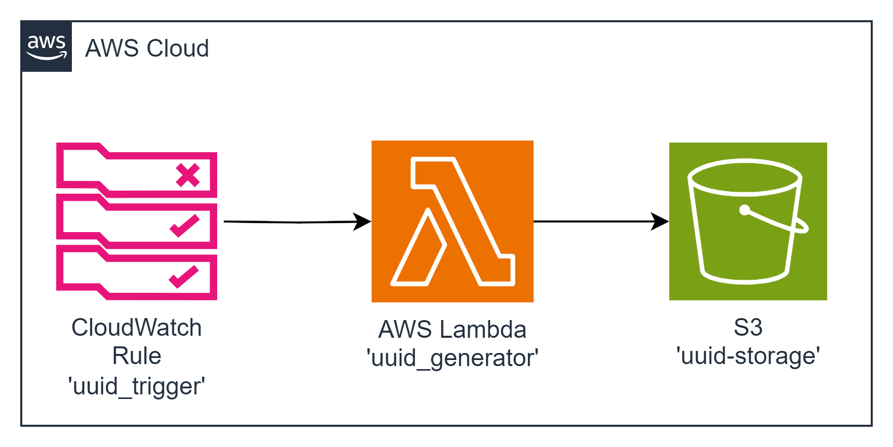

# task08 AWS Lambda + CloudWatch Rule + S3 Integration

This task involves deploying a Lambda function, a CloudWatch Rule, and an S3 bucket. The goal is to generate 10 random UUIDs every minute and store them in the S3 bucket within a new file.

Deploy a Lambda Function, CloudWatch Rule, and S3 bucket. The application must generate 10 random UUIDs every minute and store them in the S3 bucket within a new file.
##  diagram



### Resources Names
+ Lambda Function: `uuid_generator` | lambdas_alias_name: learn | target_bucket: uuid-storage
+ CloudWatch Rule: uuid_trigger
+ S3 Bucket: uuid-storage

## Example
xecution at 12:02

The file with lambda execution start time created in S3 bucket with the following content:

File Name: ISO time of execution start

File Name Example: "2024-01-01T00:00:00.000Z"
```json
{
    "ids": [
        "9bae6daa-2f72-45d3-ad58-1221de19caaa",
        ... and 9 more
    ]
}
```

---

## Deployment from scratch
1. Generate Project:

Use aws-syndicate to [generate a new project](https://github.com/epam/aws-syndicate/wiki/2.-Quick-start#221-creating-project-files). This will set up the basic structure needed for your Lambda deployment.
```powershell
syndicate generate project --name task08
```
2. Generate Config:

+ Navigate to task05 folder
```powershell
cd .\task08\
```
* Use aws-syndicate to generate a [config for your project](https://github.com/epam/aws-syndicate/wiki/2.-Quick-start#222-creating-configuration-files-for-environment3. ).
  This will set up configuration files syndicate.yml and syndicate_aliases.yml that may be edited later.
```powershell
syndicate generate config --name "dev" `
    --region "eu-central-1" `
    --bundle_bucket_name "syndicate-education-platform-custom-sandbox-artifacts-sbox02/2fa561ce/task08" `
    --prefix "cmtr-2fa561ce-" `
    --extended_prefix "true" `
    --tags "course_id:SEP_GL_7,course_type:stm,student_id:2fa561ce,type:student" `
    --iam_permissions_boundary "arn:aws:iam::905418349556:policy/eo_role_boundary" `
    --access_key "ACCESS_KEY" `
    --secret_key "SECRET_KEY" `
    --session_token "SESSION_TOKEN"
```

* Set up the SDCT_CONF environment variable pointing to the folder with syndicate.yml file.
```powershell
  $env:SDCT_CONF = "C:\projects\aws_deep_dive\AWS-Syndicate\task08\.syndicate-config-dev"
  echo $env:SDCT_CONF
```
3. Generate 'uuid_generator' Lambda Function:

Inside your project, use aws-syndicate to [generate a Lambda function](https://github.com/epam/aws-syndicate/wiki/2.-Quick-start#224-creating-lambda-files). This step will create the necessary files and configurations
```powershell
syndicate generate lambda --name uuid_generator  --runtime java
```

4. Generate S3 Bucket Resource Description:

Use aws-syndicate to [generate S3 Bucket resource description](https://github.com/epam/aws-syndicate/wiki/4.-Resources-Meta-Descriptions#44-s3-bucket).
```powershell
syndicate generate meta s3_bucket --resource_name uuid-storage
```

5. Generate CloudWatch Rule Description:

Use aws-syndicate to [generate CloudWatch Rule resource description](https://github.com/epam/aws-syndicate/wiki/4.-Resources-Meta-Descriptions#43-cloudwatch-event-rule).
```powershell
syndicate generate meta cloudwatch_event_rule --resource_name uuid_trigger --rule_type schedule --expression "cron(* * ? * * *)"
```

6. Implement the Logic of the Function:

In the Lambda function code, implement the logic to generate 10 random UUIDs and store them in an S3 bucket within a new file. Include the execution start time in the file name.

---

### Build and Deploy Project with the Syndicate Tool:

Use the aws-syndicate tool to [build and deploy your project](https://github.com/epam/aws-syndicate/wiki/2.-Quick-start#231-create-an-s3-bucket-for-aws-syndicate-artifacts). This step packages and deploys your Lambda function along with the configured API Gateway.
```powershell
syndicate create_deploy_target_bucket
```

+ [Build](https://videoportal.epam.com/video/qYLn4xd7) the artifacts of the application and create a bundle:
```powershell
syndicate build -F -b task08_250210.234925
```
+ [Deploy](https://videoportal.epam.com/video/AaZWOPjY) the bundle:
```powershell
syndicate deploy --replace_output -b task08_250210.234925
```

---

### Verification
1.  Check AWS Lambda Console:

+ Confirm that the Lambda function is listed in the AWS Lambda Console.
+ Verify that there are no deployment errors.

2. Check DynamoDB Console:

+ Confirm that the 'Configuration' and 'Audit' tables are listed in the AWS DynamoDB Console.
+ Verify that the 'Configuration' table has a DynamoDB Stream configured.

3. Check CloudWatch Logs:

+ Check the CloudWatch Logs for the Lambda function to ensure there are no errors logged during the execution.
4. Test the Application:

+ Create a configuration item in the 'Configuration' table.
+ Verify that an audit entry is created in the 'Audit' table.
5. Update Configuration Item:

+ Update a configuration item in the 'Configuration' table.
+ Verify that a corresponding audit entry is created in the 'Audit' table with the correct content.

Completing these steps successfully indicates that you have created a Lambda function triggered by a DynamoDB Stream, tracking changes to configuration items and storing audit entries in the 'Audit' table. Well done on completing this advanced AWS Lambda integration task!
