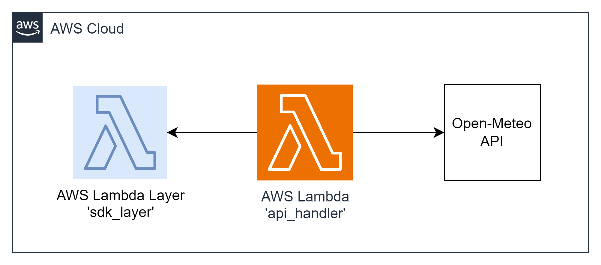

# task09 AWS Lambda + Layers Integration

This integration task involves building a Lambda Layer containing an Open-Meteo API SDK. The SDK will facilitate the retrieval of the latest weather forecast using the Open-Meteo API. Leveraging the Open-Meteo API in your Lambda function adds real-world utility, enabling you to incorporate accurate and up-to-date weather information into your serverless applications seamlessly

To develop a Lambda Layer with a custom lightweight SDK designed to streamline HTTP requests to the Open-Meteo API. This Layer will be utilized in a Lambda function responsible for retrieving and returning up-to-date weather forecasts when invoked via the URL and the /weather GET endpoint.
The Lambda function must respond with a `400 Bad Request` error for any requests directed to endpoints other than the /weather GET endpoint.

To get the weather forecast please use this [URL](https://api.open-meteo.com/v1/forecast?latitude=52.52&longitude=13.41&current=temperature_2m,wind_speed_10m&hourly=temperature_2m,relative_humidity_2m,wind_speed_10m)

##  diagram



### Resources Names
+ Lambda Function: `api_handler` | lambdas_alias_name: learn

## Example
`/weather GET`
```json
{
  "latitude": 50.4375,
  "longitude": 30.5,
  "generationtime_ms": 0.025033950805664062,
  "utc_offset_seconds": 7200,
  "timezone": "Europe/Kiev",
  "timezone_abbreviation": "EET",
  "elevation": 188.0,
  "hourly_units": {
    "time": "iso8601",
    "temperature_2m": "°C",
    "relative_humidity_2m": "%",
    "wind_speed_10m": "km/h"
  },
  "hourly": {
    "time": [
      "2023-12-04T00:00",
      "2023-12-04T01:00",
      "2023-12-04T02:00",
      "..."
    ],
    "temperature_2m": [
      -2.4,
      -2.8,
      -3.2,
      "..."
    ],
    "relative_humidity_2m": [
      84,
      85,
      87,
      "..."
    ],
    "wind_speed_10m": [
      7.6,
      6.8,
      5.6,
      "..."
    ]
  },
  "current_units": {
    "time": "iso8601",
    "interval": "seconds",
    "temperature_2m": "°C",
    "wind_speed_10m": "km/h"
  },
  "current": {
    "time": "2023-12-04T07:00",
    "interval": 900,
    "temperature_2m": 0.2,
    "wind_speed_10m": 10.0
  }
}
```
`400 Bad Request`
```json
{
    "statusCode": 400,
    "message": "Bad request syntax or unsupported method. Request path: {path}. HTTP method: {method}"
}
```
---

## Deployment from scratch
1. Generate Project:

Use aws-syndicate to [generate a new project](https://github.com/epam/aws-syndicate/wiki/2.-Quick-start#221-creating-project-files). This will set up the basic structure needed for your Lambda deployment.
```powershell
syndicate generate project --name task09
```
2. Generate Config:

+ Navigate to task05 folder
```powershell
cd .\task09\
```
* Use aws-syndicate to generate a [config for your project](https://github.com/epam/aws-syndicate/wiki/2.-Quick-start#222-creating-configuration-files-for-environment3. ).
  This will set up configuration files syndicate.yml and syndicate_aliases.yml that may be edited later.
```powershell
syndicate generate config --name "dev" `
    --region "eu-central-1" `
    --bundle_bucket_name "syndicate-education-platform-custom-sandbox-artifacts-sbox02/2fa561ce/task08" `
    --prefix "cmtr-2fa561ce-" `
    --extended_prefix "true" `
    --tags "course_id:SEP_GL_7,course_type:stm,student_id:2fa561ce,type:student" `
    --iam_permissions_boundary "arn:aws:iam::905418349556:policy/eo_role_boundary" `
    --access_key "ACCESS_KEY" `
    --secret_key "SECRET_KEY" `
    --session_token "SESSION_TOKEN"
```

* Set up the SDCT_CONF environment variable pointing to the folder with syndicate.yml file.
```powershell
  $env:SDCT_CONF = "C:\projects\aws_deep_dive\AWS-Syndicate\task09\.syndicate-config-dev"
  echo $env:SDCT_CONF
```
3. Generate ' api_handler' Lambda Function:

Inside your project, use aws-syndicate to [generate a Lambda function](https://github.com/epam/aws-syndicate/wiki/2.-Quick-start#224-creating-lambda-files). This step will create the necessary files and configurations
```powershell
syndicate generate lambda --name  api_handler  --runtime java
```

4. Implement Open-Meteo API:

+ Create a class that utilizes a library to perform HTTP requests, allowing access to the Open-Meteo API for retrieving the latest weather forecast. Avoid using the Open-Meteo SDK.

5. Assemble Lambda Layer:

+ Organize your code into a structure suitable for a Lambda Layer.
```powershell
syndicate generate lambda_layer --name weather-service-layer --runtime java --link_with_lambda api_handler
```

!!! Generation of lambda layer for Java runtime is currently unsupported. A layer for lambda with Java runtime can be added to the project by using the annotation '@LambdaLayer'.

6. Implement the Logic of the Function:

In the Lambda function code, implement the logic to generate 10 random UUIDs and store them in an S3 bucket within a new file. Include the execution start time in the file name.

7. Implement the Logic of the Function:

+ In the Lambda function code, import and employ the Open-Meteo API library from the Lambda Layer to fetch the most recent weather forecast.

---

### Build and Deploy Project with the Syndicate Tool:

Use the aws-syndicate tool to [build and deploy your project](https://github.com/epam/aws-syndicate/wiki/2.-Quick-start#231-create-an-s3-bucket-for-aws-syndicate-artifacts). This step packages and deploys your Lambda function along with the configured API Gateway.
```powershell
syndicate create_deploy_target_bucket
```

+ [Build](https://videoportal.epam.com/video/qYLn4xd7) the artifacts of the application and create a bundle:
```powershell
syndicate build -F -b task09_250214.111138
```
+ [Deploy](https://videoportal.epam.com/video/AaZWOPjY) the bundle:
```powershell
syndicate deploy --replace_output -b task09_250214.111138
```

---

### Verification
1. Check AWS Lambda Console:
+ Confirm that the Lambda function is listed in the AWS Lambda Console.
+ Verify that there are no deployment errors.

2. Check Lambda Layer Console:
+ Confirm that the Lambda Layer is listed in the AWS Lambda Console.
+ Verify that the SDK code is correctly organized and accessible.

3. API Client Request:

+ Use your chosen API client (Postman, Insomnia) to send a GET request to the function URL (/weather) of the Lambda function.
+ Verify that the response contains the latest weather forecast fetched using the SDK from the Lambda Layer.

4. CloudWatch Logs:

+ Check the CloudWatch Logs for the Lambda function to ensure there are no errors logged during the execution.
