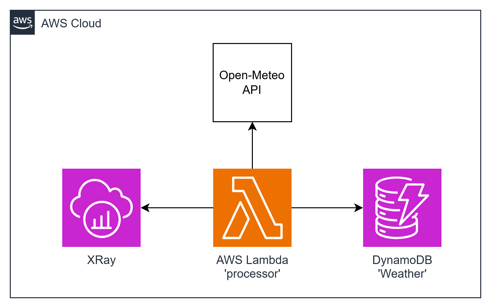

# task10 AWS Lambda + XRay Integration

This task involves deploying a Lambda function triggered by a Function URL, which pulls the latest weather forecast from the Open-Meteo API and pushes it to DynamoDB. The goal is to trace the execution of the code using AWS X-Ray.

To deploy a Lambda function that, when triggered by a Function URL, pulls the latest weather forecast from the Open-Meteo API and pushes it to DynamoDB. The execution of the code should be traced using AWS X-Ray.

To get the weather forecast please use this [URL](https://api.open-meteo.com/v1/forecast?latitude=52.52&longitude=13.41&current=temperature_2m,wind_speed_10m&hourly=temperature_2m,relative_humidity_2m,wind_speed_10m)

##  diagram



### Resources Names
+ Lambda Function: `processor` | lambdas_alias_name: learn
+ DynamoDB Table: Weather |target_table: Weather

## Example
+ 'Weather' DynamoDB table schema
```json
{
  "id": str, // uuidv4
  "forecast": {
     "elevation": number,
     "generationtime_ms": number,
     "hourly": {
         "temperature_2m": [number],
         "time": [str]
      },
      "hourly_units": {
         "temperature_2m": str,
         "time": str
      },
      "latitude": number,
      "longitude": number,
      "timezone": str,
      "timezone_abbreviation": str,
      "utc_offset_seconds": number
  }
}
```

---

## Deployment from scratch
1. Generate Project:

Use aws-syndicate to [generate a new project](https://github.com/epam/aws-syndicate/wiki/2.-Quick-start#221-creating-project-files). This will set up the basic structure needed for your Lambda deployment.
```powershell
syndicate generate project --name task10
```
2. Generate Config:

+ Navigate to task05 folder
```powershell
cd .\task10\
```
* Use aws-syndicate to generate a [config for your project](https://github.com/epam/aws-syndicate/wiki/2.-Quick-start#222-creating-configuration-files-for-environment3. ).
  This will set up configuration files syndicate.yml and syndicate_aliases.yml that may be edited later.
```powershell
syndicate generate config --name "dev" `
    --region "eu-central-1" `
    --bundle_bucket_name "syndicate-education-platform-custom-sandbox-artifacts-sbox02/2fa561ce/task08" `
    --prefix "cmtr-2fa561ce-" `
    --extended_prefix "true" `
    --tags "course_id:SEP_GL_7,course_type:stm,student_id:2fa561ce,type:student" `
    --iam_permissions_boundary "arn:aws:iam::905418349556:policy/eo_role_boundary" `
    --access_key "ACCESS_KEY" `
    --secret_key "SECRET_KEY" `
    --session_token "SESSION_TOKEN"
```

* Set up the SDCT_CONF environment variable pointing to the folder with syndicate.yml file.
```powershell
  $env:SDCT_CONF = "C:\projects\aws_deep_dive\AWS-Syndicate\task10\.syndicate-config-dev"
  echo $env:SDCT_CONF
```
3. Generate ' processor' Lambda Function:

Inside your project, use aws-syndicate to [generate a Lambda function](https://github.com/epam/aws-syndicate/wiki/2.-Quick-start#224-creating-lambda-files). This step will create the necessary files and configurations
```powershell
syndicate generate lambda --name  processor  --runtime java
```
4. Generate DynamoDB Metadata
   Use aws-syndicate to [generate metadata for a DynamoDB](https://github.com/epam/aws-syndicate/wiki/4.-Resources-Meta-Descriptions#421-dynamo-db-table) table named 'Weather'.
```powershell
syndicate generate meta dynamodb --resource_name Weather --hash_key_name id --hash_key_type S
```

5. Implement the Logic of the Function:

In the Lambda function code, implement the logic to pull the latest weather forecast from the Open-Meteo API and push it to DynamoDB.
**To get the weather forecast please use this [URL](
https://api.open-meteo.com/v1/forecast?latitude=52.52&longitude=13.41&current=temperature_2m,wind_speed_10m&hourly=temperature_2m,relative_humidity_2m,wind_speed_10m)**

---

### Build and Deploy Project with the Syndicate Tool:

Use the aws-syndicate tool to [build and deploy your project](https://github.com/epam/aws-syndicate/wiki/2.-Quick-start#231-create-an-s3-bucket-for-aws-syndicate-artifacts). This step packages and deploys your Lambda function along with the configured API Gateway.
```powershell
syndicate create_deploy_target_bucket
```

+ [Build](https://videoportal.epam.com/video/qYLn4xd7) the artifacts of the application and create a bundle:
```powershell
syndicate build -F -b task10_250217.122353
```
+ [Deploy](https://videoportal.epam.com/video/AaZWOPjY) the bundle:
```powershell
syndicate deploy --replace_output -b task10_250217.122353
```

---

### Verification
1. Check AWS Lambda Console:
+ Confirm that the Lambda function is listed in the AWS Lambda Console.
+ Verify that there are no deployment errors.

2. Check Lambda Layer Console:
+ Confirm that the Lambda Layer is listed in the AWS Lambda Console.
+ Verify that the SDK code is correctly organized and accessible.

3. API Client Request:

+ Use your chosen API client (Postman, Insomnia) to send a GET request to the function URL (/weather) of the Lambda function.
+ Verify that the response contains the latest weather forecast fetched using the SDK from the Lambda Layer.

4. CloudWatch Logs:

+ Check the CloudWatch Logs for the Lambda function to ensure there are no errors logged during the execution.
